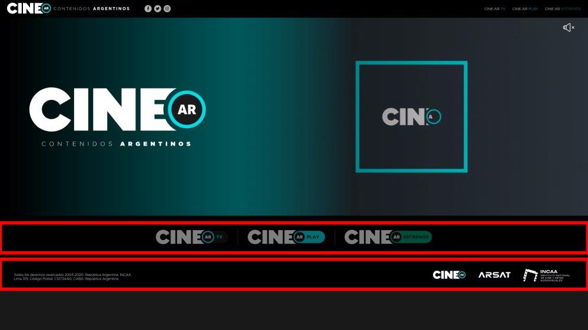
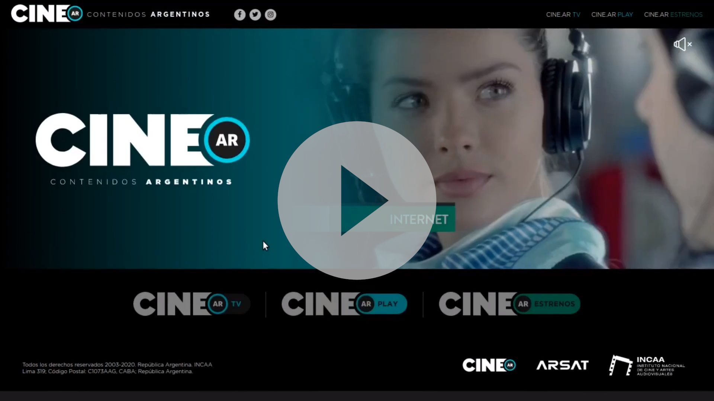
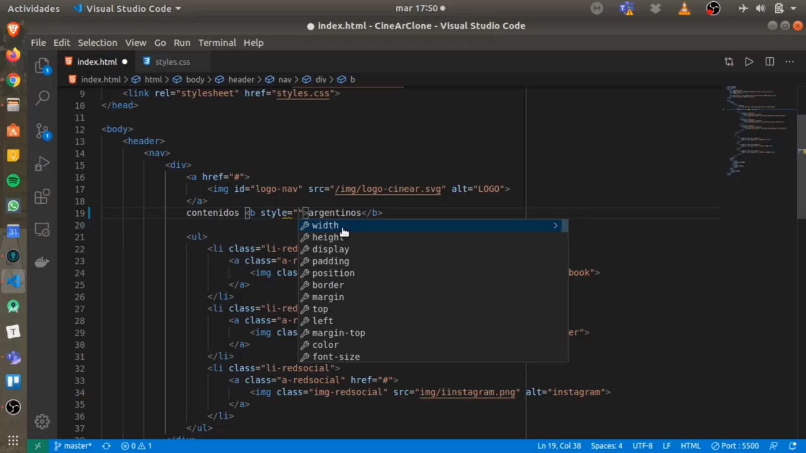

# Introducción.

Para esta nueva actividad el desafío propuesto es construir un clon de la página inicial del sitio [cine.ar](http://cine.ar/). Gran parte del trabajo ya está realizado y disponible en este [repositorio](https://github.com/joaquinbf/CineArClone) en GitHub desde el cual pueden descargarse todo el código o bien crear un [repl](https://repl.it/) (para esta segunda opción es importante crear una cuenta en [repl.it](https://repl.it/), por cualquier duda se puede consultar el siguiente [video](https://web.microsoftstream.com/video/c0903ff6-3b4f-4c35-af3c-ac3caae6673f)). 

Solo resta construir dos secciones: 

- La sección inferior del cuerpo principal del sitio. 
- El pie de página. 

Ambas secciones deben ser idénticas a las que se encuentran en el sitio original en su versión para escritorio. 



# Guía Practica.

Con esta guía se pretende organizar cada una de las tareas que se requieren para completar la actividad. 

Empezaremos por los logos de sitios externos como `cine.ar.tv, cine.ar.play y cine.ar.estrenos`. Y luego, nos encargaremos del pie de pagina.

## Links a sitios externos.

### Maquetado en `HTML`.

El espacio que se propone para colocar los distintos logos de `cine.ar.tv, cine.ar.play y cine.ar.estrenos` es la sección cuya clase es `extern-links-section`. 

> Nota: Antes de continuar con la lectura, seria interesante que analices un momento la sección y por cuenta propia intentes realizar un maquetado. Después podes corroborar con las opciones que te dejamos mas abajo y de esta forma saber si estabas o no en lo correcto.

Para poder en cuanto al maquetado en `HTML`, se puede optar por varias opciones. La primera y mas usada es aquella que utiliza listas desordenadas.

```html
<nav>
	<ul>
		<li> 
            <a href="...">
            	
            </a> 
        </li>	
        <li> 
            <a href="...">
            	
            </a> 
        </li>	
        <li> 
            <a href="...">
            	
            </a> 
        </li>	
    
	</ul>
</nav>
```

Otra posible, un poco menos engorrosa podría ser

```html
<nav>
    <a href="...">
        
    </a> 

    <a href="...">
        
    </a> 

    <a href="...">
        
    </a> 
</nav>
```

Acá tenes un ejemplo de como y donde se aplican esta misma estructura en el desafió, te dejo este vídeo.

[](https://web.microsoftstream.com/video/0567f4a9-adad-4b25-baa5-06460bd750c1)

> Preguntas de repaso: ¿Cual es el propósito de la etiqueta `nav`?

### `CSS` de las imágenes `SVG`.

Puede ocurrir que las imágenes no se muestren y esto es algo muy común sobre todo si se usa el formato `svg` como es en nuestro caso.

> Nota: Intenta investigar que es el formato `svg` y sus ventajas frente a otros formatos de imágenes.

Pero esto se puede arreglar muy fácilmente con `CSS`. El reto que te propongo es intentar resolver este problema.

> Ayuda: Si inspecciono el elemento, lo mas probable es que me diga que las imágenes tiene altura o ancho de tamaño 0.
>
> Ayuda: Existen varias opciones para seleccionar las imágenes de nuestra sección en `CSS` y actuar sobre ellas. Te recomiendo darle un pequeño repaso a este [apunte](https://developer.mozilla.org/es/docs/Web/CSS/Selectores_CSS)

### Flexbox para alinear elementos.

Si las imágenes ya aparecieron, solo resta centrarlas. Para esto, existen muchos métodos distintos, pero como lo indica el titulo, utilizaremos flexbox.

> Nota: Si aun no queda claro como usar flexbox, se recomienda leer  la siguiente [guia](https://css-tricks.com/snippets/css/a-guide-to-flexbox/) que es muy fácil de entender.

> Ayuda: En este caso, ¿cual es la caja que contiene a todos los elementos que queremos centrar?

Te dejamos un vídeo donde se ve, entre otros temas, como se aplica flexbox en nuestro ejemplo.

[](https://web.microsoftstream.com/video/392679b1-1cdd-40c7-9aa8-fc4eb8ffeec7)

### Espaciado entre los elementos.

Si observan bien la versión original de http://cine.ar/, pueden ver que existe una separación entre los logos. 

Al mismo tiempo, la sección `extern-links-section` esta separa de las demás secciones. 

El reto para este punto es lograr esos dos espaciados. 

> Ayuda: Una frase muy importante es:
>
> - Si quiero separar el contenido de los bordes de su caja, utilizo `padding`.
> - Si quiero separar los elementos entre si, utilizo `margin`
>
> Para este caso, ¿cual usarías?

En este caso, te dejamos dos vídeos que hablan sobre este tema.

| Parte 1                                                      | Parte 2                                                      |
| ------------------------------------------------------------ | ------------------------------------------------------------ |
| [](https://web.microsoftstream.com/video/b3a9cd47-94ed-4fd9-bbac-d1f67eef4bef) | [](https://web.microsoftstream.com/video/ece75dc9-15dc-49a7-8aa2-637c4969a139) |

## Pie de pagina.

En este punto te pediría que te tomes un tiempo y analices el caso. Intentes hacer por cuenta propia un maquetado en `HTML` sobre los elementos que se necesitan para completar este punto, como aplicarías `CSS` y `Flexbox` para resolver que el diseño de esta sección sea coherente con la pagina original.

### Maquetado en `HTML`.

Este punto es excelente para poder aplicar nuestros conocimientos sobre **estructura `HTML`**. En principio existen cuatro elementos: un párrafo y tres logos, pero los logos están agrupados lo que nos indica que existen algún tipo de contenedor que los mantiene juntos. 

Mi recomendación para esto es hacer de estos tres logos otra barra de navegación quedando una estructura parecida a esta:

```html
<footer>
	<p>
        Todos los derechos....
    </p>
    
    <nav>
    	... logos ...
    </nav>
</footer>
```

### Aplicando `CSS` en texto.

Puede ocurrir que el párrafo no se vea, esto se debe a que por defecto, los navegadores aplican el color negro sobre cualquier tipografía. Intente:

- Modificar cambiar el color del párrafo a blanco.
- Modificar la tipografía del párrafo a la que se utiliza en todo el proyecto.

[](https://web.microsoftstream.com/video/b4a155c4-6dbb-4396-a206-a00c97067fc2)

### Aplicando Flexbox en  `footer`.

No queda mucho por decir, así que simplemente te dejaremos una ayuda que te puede servir.

> Ayuda: Antes ya usamos cajas flexibles para centrar los elementos, pero ahora, lo que queremos es que haya todo el espacio posible entre el párrafo y la barra de navegación.